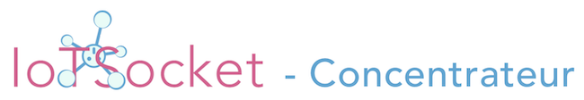

## Concentrateur/Routeur/API pour les plateformes d'objets connectés.

- Implémente le protocole [IoTSocket Protocol (draft v0.07)](https://github.com/jczic/IoTSocket-Concentrator/blob/master/Protocole%20IoTSocket%20(draft-v0.07).pdf).
- Utilise la couche sockets asynchrone I/O [XAsyncSockets](https://github.com/jczic/XAsyncSockets).
- Permet des échanges en TCP, UDP et HTTP(S).
- Supporte le dialogue avec des APIs Web de type REST.
- Assure le maintient de milliers de connexions persistantes.
- Sécurise les communications par chiffrement TLS et clés/jetons.
- Finement paramétrable via fichier de configuration JSON.

    

-------------------------------------------------------------------------------------------

### Le routage, cœur du concentrateur
- Traite et applique toutes les valeurs spécifiques définies par le fichier de configuration.
- Orchestre les échanges, requêtes et réponses, depuis et vers les différents éléments.
- Procède au traitement asynchrone et parallèle des flux de données entrants et sortants.
- Maintient et applique les droits d’accès des éléments (sessions, clé d’API Web).
- Garde en mémoire les données à transmettre durant certaines déconnexions.
- Gère le pool de l’ensemble des connexions persistantes, serveurs et écouteurs.
- Contrôle le système de suivi entre les requêtes Web HTTP(S) routées et leur réponse.
- Permet des échanges formatés et typés en binaire, ASCII, UTF-8 et JSON.

### Le serveur TCP
- Est le point de terminaison des sessions entrantes pour le central et les objets.
- Sécurise l’authentification des sessions par négociation de clé via challenge.
- Utilise le chiffrage des échanges avec certificat par application d’une couche TLS (SSL).
- Assure la persistance des connexions ainsi que l’expiration des opérations trop longues.
- Maintient les données de session à transmettre durant certains types de déconnexions.

### Le serveur UDP
- Est le point de terminaison de l’écouteur des datagrammes contenant la télémétrie.
- Sécurise les remontées de données par système de jetons uniques et aléatoires.

### Le serveur HTTP(S)
- Est le point de terminaison Web pour les requêtes provenant du central vers les objets.
- Utilise le chiffrage des échanges avec certificat par application d’une couche TLS (SSL).
- Assure le maintient des requêtes jusqu’au retour de réponse ou temps d’attente expiré.
- Fonctionne tel qu’une API Web JSON (type REST) avec authentification par clé d’API.

### Le client HTTP(S)
- Redirige les requêtes d’objets vers le central au moyen de WebHooks HTTP(S).
- Contrôle le système de suivi entre les requêtes et leur réponse auprès des objets.
- Fonctionne tel qu’un retour d’API Web JSON avec authentification par clé d’API.

    

    

### By JC`zic for [HC²](https://www.hc2.fr) ;')
